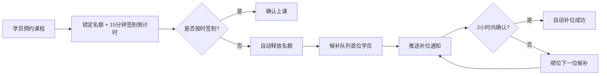
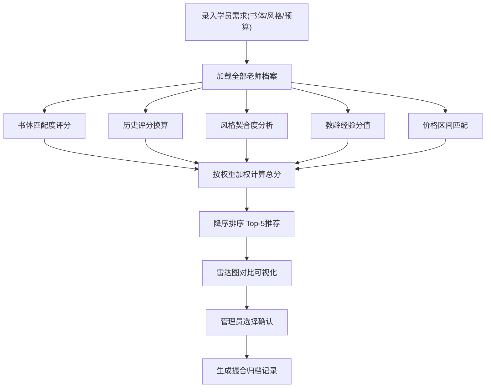

## 1. 产品概述

书法培训排课系统是一款面向书法教育机构的智能排课与师资撮合平台，解决课程预约管理、候补自动补位、师资智能匹配等核心痛点，提升运营效率与学员满意度。

- 目标用户：书法培训机构管理员、教务人员、授课老师
- 核心价值：自动化排课释放人力、多维打分确保师资匹配精准度、候补机制最大化教室利用率

---

## 2. 核心功能

### 2.1 用户角色

| 角色 | 登录方式 | 核心权限 |
|------|----------|----------|
| 系统管理员 | 账号密码 | 全部功能：教室/老师/学员建档、权重配置、排课、撮合归档 |
| 教务人员 | 账号密码 | 排课管理、候补登记、推荐撮合、作品展评 |

### 2.2 功能模块

1. **课程排期模块**：教室建档、课程创建、排期日历、预约管理、超时自动释放
2. **候补补位模块**：候补排队登记、自动顺位通知、补位确认、队列状态可视化
3. **多维推荐模块**：老师/学员多维档案、打分模型配置、权重可调、推荐列表排序
4. **撮合归档模块**：撮合确认、上课记录、作品展评登记、历史归档查询

### 2.3 页面详情

| 页面名称 | 模块名称 | 功能描述 |
|----------|----------|----------|
| 总览仪表盘 | 数据概览 | 今日课程数、在候人数、撮合成功率、最近活动时间线 |
| 课程排期 | 教室管理 | 教室建档（名称/容量/设备/书体适配）、编辑、状态切换 |
| 课程排期 | 排期日历 | 周视图日历、拖拽排课、课程状态标签（已满/有空/已结束） |
| 课程排期 | 预约管理 | 学员预约、签到确认、超时15分钟自动释放名额 |
| 候补补位 | 候补队列 | 按课程分组显示候补名单、顺位序号、等待时长、状态标记 |
| 候补补位 | 通知中心 | 补位通知推送（模拟）、确认/拒绝操作、2小时响应超时处理 |
| 多维推荐 | 档案管理 | 老师档案（书体/评分/风格/教龄/价格）、学员档案（学习目标/偏好书体/风格倾向） |
| 多维推荐 | 权重配置 | 书体匹配度/历史评分/风格契合度/教龄/价格区间 等权重滑块实时调节 |
| 多维推荐 | 推荐引擎 | 根据学员需求计算综合得分、Top-N推荐列表、匹配维度雷达图对比 |
| 撮合归档 | 撮合管理 | 推荐确认、师生撮合绑定、排课自动关联 |
| 撮合归档 | 作品展评 | 学员作品上传、评分登记、老师评语、作品展示墙 |
| 撮合归档 | 历史归档 | 按时间/老师/学员多维筛选、课程历史记录导出视图 |

---

## 3. 核心流程

### 3.1 课程预约 → 超时释放 → 候补补位流程

学员在课程排期页面预约课程 → 系统锁定名额并设置15分钟签到倒计时 → 
若超时未签到 → 自动释放名额 → 从候补队列取首位学员 → 推送补位通知 → 
学员2小时内确认 → 确认后自动入队 / 超时则顺位下一位

### 3.2 多维推荐撮合流程

创建学员需求 → 系统读取老师档案 → 根据配置权重计算各维度得分 → 
加权汇总综合评分 → 降序排列生成Top-5推荐 → 管理员选择确认 → 
生成撮合记录 → 自动创建关联课程排期

---

## 4. 用户界面设计

### 4.1 设计风格

- **主色**：墨色 `#1a1a2e`（沉稳专业）搭配朱砂红 `#c0392b`（中国传统书法元素）
- **辅色**：宣纸米白 `#f5f0e1` 作背景、竹青 `#2d5a3d` 作成功状态色
- **按钮风格**：圆角10px、微立体阴影、hover时朱砂红边框高亮
- **字体**：标题用「思源宋体 CN」呼应书法气质，正文用「思源黑体 CN」保障可读性
- **布局风格**：左侧导航栏 + 顶部面包屑 + 主内容卡片式布局
- **装饰元素**：背景加入淡淡的宣纸纹理、关键数据卡加入毛笔笔触装饰线

### 4.2 页面设计概览

| 页面名称 | 模块名称 | UI元素 |
|----------|----------|--------|
| 仪表盘 | 数据概览 | 4个KPI卡（渐变背景+毛笔分隔线）、最近活动时间线（朱砂红节点）、本周排课热力图 |
| 课程排期 | 排期日历 | 周视图7列网格、课程色块区分书体、hover详情浮层、已释放名额闪烁提示 |
| 候补补位 | 候补队列 | 卡片式队列、顺位徽章（金/银/铜渐变）、等待时长进度条、一键通知按钮 |
| 多维推荐 | 权重配置 | 6个权重滑块、实时总分预览、一键重置、推荐结果随权重变化实时刷新 |
| 多维推荐 | 推荐列表 | 老师卡带雷达图迷你图、综合分数值大号高亮、各维度得分进度条 |
| 撮合归档 | 作品展评 | 瀑布流作品墙、hover显示评分标签、点击打开评语模态框 |

### 4.3 响应式设计

- **桌面优先**：≥1280px 完整四栏布局
- **平板适配**：768-1279px 导航折叠为图标、日历缩减为5日视图
- **移动端**：<768px 底部Tab导航、日历切换为日视图列表、推荐列表简化为单列纯文本

### 4.4 动效设计

- 页面加载：卡片从下至上渐入， stagger 延迟 80ms
- 名额释放：名额状态「抖动+渐变」过渡动画，持续600ms
- 推荐刷新：雷达图数据切换时 smooth 过渡 400ms
- 权重调节：滑块拖动时，各维度得分条实时增减动画
