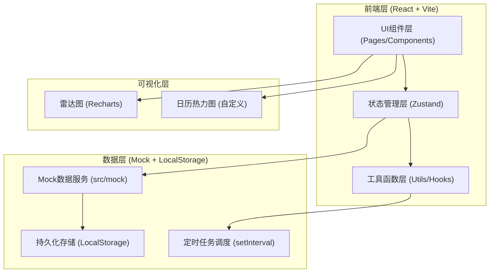
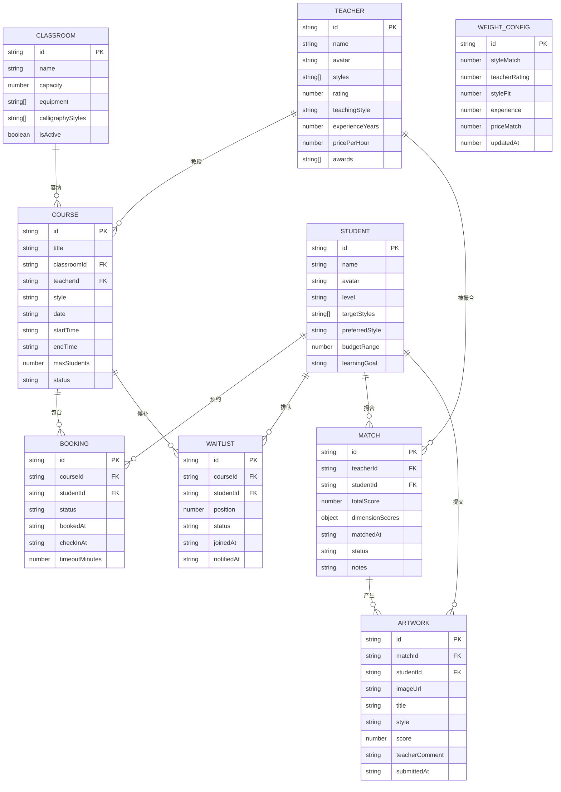
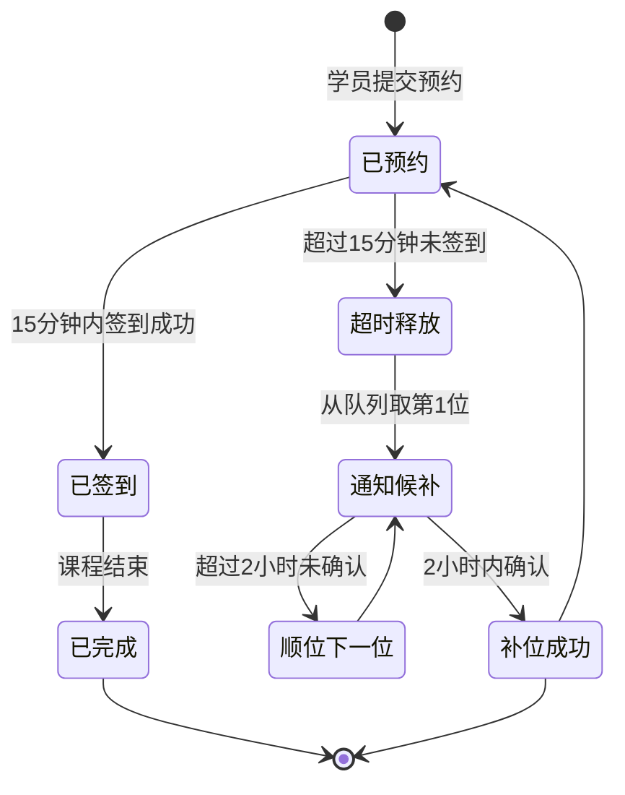

## 1. 架构设计



## 2. 技术说明

- **前端框架**：React@18 + TypeScript + Vite
- **状态管理**：Zustand（轻量级 store，支持 persist 中间件持久化）
- **样式方案**：Tailwind CSS@3 + CSS 变量（主题色系统）
- **路由管理**：React Router DOM@6
- **图表可视化**：Recharts（雷达图、柱状图、热力图）
- **图标库**：Lucide React
- **后端方案**：无独立后端，使用 Mock 数据 + LocalStorage 持久化
- **超时机制**：前端 setInterval 模拟服务端定时任务轮询（10秒一次）
- **项目初始化模板**：react-ts（纯前端，Mock 数据驱动）

## 3. 路由定义

| 路由路径 | 页面名称 | 功能说明 |
|----------|----------|----------|
| `/` | 仪表盘总览 | 今日课程、候补人数、撮合数据、活动时间线 |
| `/schedule` | 课程排期 | 教室管理、周视图日历、预约/签到管理 |
| `/waitlist` | 候补补位 | 候补队列、通知中心、补位状态追踪 |
| `/recommend` | 多维推荐 | 师生档案、权重配置、推荐列表排序 |
| `/archive` | 撮合归档 | 撮合记录、作品展评、历史档案查询 |

## 4. 数据模型定义

### 4.1 ER 数据关系图



## 5. Zustand Store 模块划分

| Store 名称 | 文件路径 | 核心状态 | Action 方法 |
|------------|----------|----------|-------------|
| useClassroomStore | `src/stores/classroom.ts` | 教室列表、当前教室 | CRUD、启用/停用 |
| useCourseStore | `src/stores/course.ts` | 课程列表、当前视图日期 | 排课、预约、签到、超时释放检测 |
| useTeacherStore | `src/stores/teacher.ts` | 老师档案列表 | CRUD、按书体筛选 |
| useStudentStore | `src/stores/student.ts` | 学员档案列表 | CRUD、按偏好筛选 |
| useBookingStore | `src/stores/booking.ts` | 预约记录集合 | 创建预约、签到、超时释放 |
| useWaitlistStore | `src/stores/waitlist.ts` | 候补队列数据 | 入队、出队、通知、顺位 |
| useRecommendStore | `src/stores/recommend.ts` | 权重配置、推荐结果 | 权重更新、计算得分、生成推荐 |
| useMatchStore | `src/stores/match.ts` | 撮合记录集合 | 确认撮合、归档查询 |
| useArtworkStore | `src/stores/artwork.ts` | 作品数据 | 提交、评分、评语登记 |
| useNotificationStore | `src/stores/notification.ts` | 消息通知队列 | 推送、标记已读、确认补位 |

## 6. 核心工具函数模块

| 文件路径 | 函数名称 | 功能说明 |
|----------|----------|----------|
| `src/utils/scoring.ts` | `calculateMatchScore()` | 根据权重配置计算单个老师与学员的匹配综合分 |
| `src/utils/scoring.ts` | `rankTeachers()` | 批量计算并降序排序推荐老师列表 |
| `src/utils/time.ts` | `isTimeout()` | 判断预约是否超过签到时间 |
| `src/utils/time.ts` | `formatDuration()` | 格式化候补等待时长显示 |
| `src/utils/scheduler.ts` | `startTimeoutChecker()` | 启动超时轮询定时器 |
| `src/utils/scheduler.ts` | `checkAndReleaseBookings()` | 批量检查并释放超时预约 |
| `src/utils/scheduler.ts` | `processWaitlistNotification()` | 处理候补顺位通知逻辑 |

## 7. 推荐算法核心逻辑

多维匹配得分公式（加权平均，各维度得分 0-100）：

```
总分 = 书体匹配度 × W1 + 老师评分 × W2 + 风格契合度 × W3 + 教龄经验 × W4 + 价格匹配 × W5

其中 W1+W2+W3+W4+W5 = 1.0，默认权重：
  W1 = 0.30 (书体匹配)
  W2 = 0.25 (历史评分)
  W3 = 0.20 (风格契合)
  W4 = 0.15 (教龄经验)
  W5 = 0.10 (价格匹配)
```

各维度计算规则：
1. **书体匹配度**：学员目标书体与老师擅长书体交集占比 × 100
2. **老师评分**：老师历史评分 × 20（5分制换算为百分制）
3. **风格契合度**：学员偏好风格与老师教学风格语义匹配度（枚举映射）× 100
4. **教龄经验**：min(老师教龄 / 20, 1) × 100
5. **价格匹配**：1 - min(|老师时薪 - 学员预算中位| / 学员预算中位, 1) 差值换算为相似度

## 8. 超时释放与候补流程状态机


